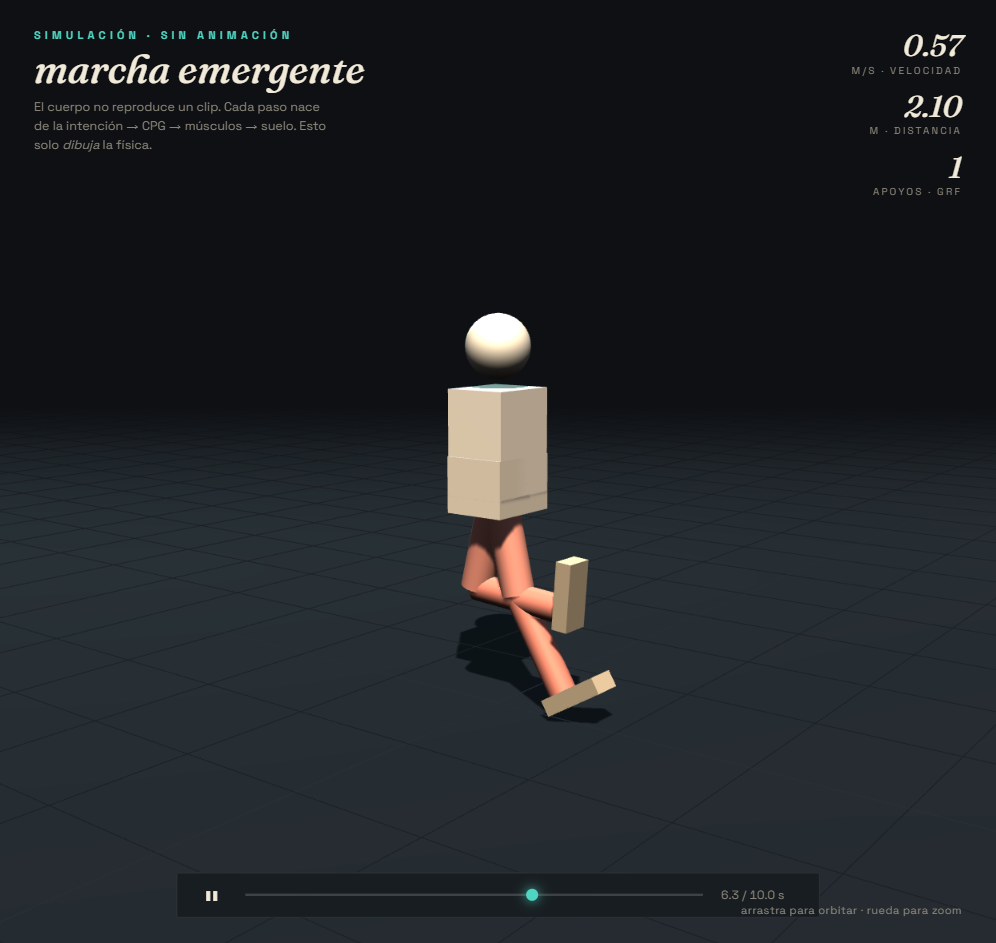
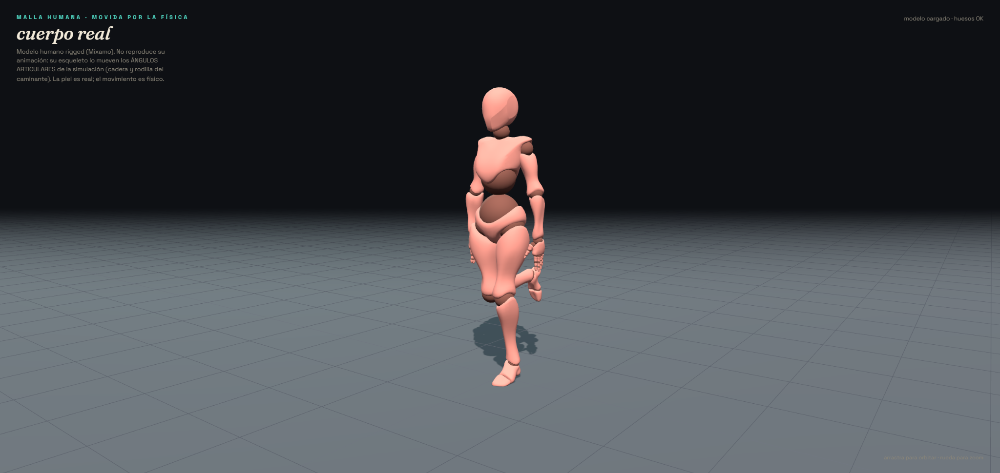
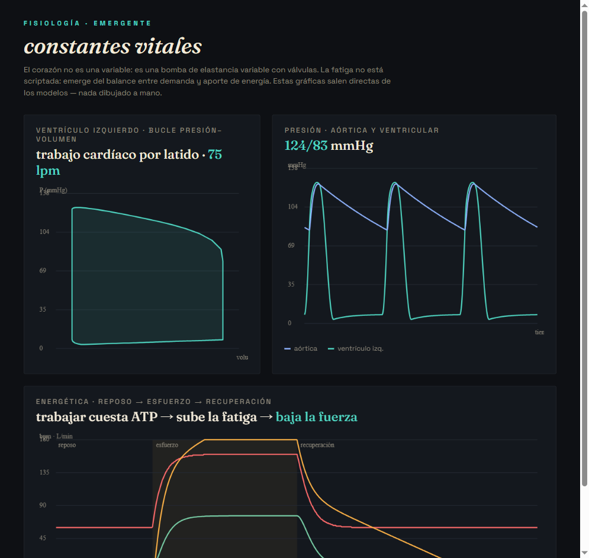
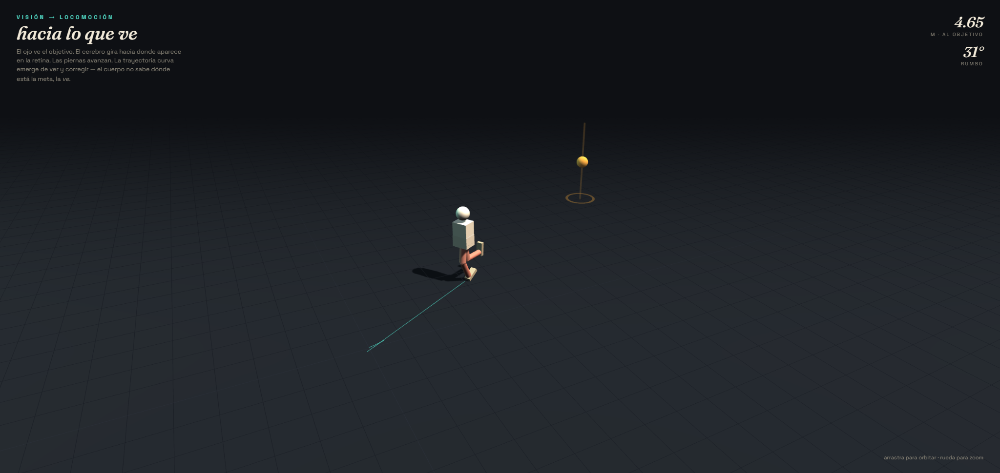

# SOMA — Simulated Object Motion Architecture

Simulador de un ser humano completo desde cero.
Todo emerge de física y mecánica. Cero animaciones. Cero keyframes. Cero scripts prefabricados.

El usuario controla **intención**, no actuadores. El cuerpo hace el resto.

## Principio único

> Nada ocurre porque una animación lo diga.
> Todo ocurre porque un sistema físico o mecánico lo causa.

Caminar no es un clip. Caminar es: agente decide → controles conducen → actuadores se contraen → tirantes transmiten → huesos rotan → suelo reacciona → vestíbulo corrige → cuerpo avanza.

## Estado

- **Fase 0 — COMPLETA y verificada.** Núcleo L0+L1: unidades SI con chequeo dimensional en compilación, matemáticas (vec/mat/quat/transform), RNG determinista, tiempo multi-tasa, bus de mensajes + blackboard, ECS, solvers ODE, scheduler multi-tasa, LOD.
- **Fase 1 — casi COMPLETA.** L2 física: cuerpo rígido (integración semi-implícita, inercia, fuerzas en punto), gravedad, contacto con el suelo, articulación esférica, ragdoll articulado, límites articulares de partess. Falta: colliders reales (cápsulas/mallas), Featherstone (LOD científico), armadura real desde Parameter DB.
- **Fase 2 — EN CURSO.** L3 partes: actuador no lineal (fuerza-longitud, fuerza-velocidad, pasiva) acoplado a huesos. **Hito alcanzado**: activar un actuador flexiona el hueso por física, cero animación. Falta: tirante elástico en serie, wrapping, desgaste/energía.
- **Fase 3 — EN CURSO.** L5 realimentación de estiramiento + CPG (Matsuoka) + osciladores acoplados, L6 sensor de articulación, L7 controlador motor PD (emite activación, no par). **Hitos alcanzados**: actuadores antagonistas mantienen postura y rechazan perturbaciones; el CPG genera ritmo y conduce articulaciones; una pierna de 2 segmentos coordina cadera–rodilla con desfase controlado (patrón de zancada). Falta: unidad motora explícita, cuerpo de pie con equilibrio global.

- **Fase 5 — EN CURSO.** L6 vestíbulo, L7 control postural (estrategia de tobillo). **Hitos**: péndulo invertido erguido por realimentación (cae sin actuadores, recupera de empujones); y **de pie SIN pin ni rig** sobre un pie físico (talón+punta con contacto y fricción). Falta: cuerpo multi-segmento de pie.
- **Fase 6 — EN CURSO.** L7 intención + L2 contacto plantar. **Hito (con rig de soporte de peso)**: `intención: caminar` → CPG → control → actuadores → suelo → **AVANZA +3 m** (~0.38 m/s); sin intención no se mueve. `gait_benchmark` valida la marcha (v=0.38 m/s, cadencia 1.4 Hz, GRF de pico, duty). Falta: equilibrio dinámico sin rig durante la marcha (reto abierto).
- **Fase 7 — EN CURSO.** L6 cámara (óptica estenopeica) + L7 corteza visual + navegación. **Hitos**: el agente reconstruye la dirección a un objeto **solo desde la sensor** (nunca lee su posición); y el cuerpo **camina hacia lo que ve** — servovisión (gira hacia la posición retiniana del objetivo) + avance del caminante → trayectoria curva emergente que alcanza la meta; ciego, no la alcanza. Visible en 3D (`navigate.html`).
- **Fase 8 — EN CURSO.** L4 telemetría energética. **Bomba**: bomba por elastancia variable + válvulas + R–C — **124/80 u, throughput 5.7 u/min, ef 54 %**; el mando alto sube a 141 /min y 9.1 u/min. **Buffer de energía + fuelle**: trabajar cuesta energía; si la demanda supera la vía sostenible → ansostenible → residuo + **desgaste**, y la fuerza de actuador **baja como consecuencia**; bomba y fuelle se aceleran (tasa 60→160, caudal 6→76 u/min); en reposo, recupera. Falta: cámaras derechas + circuito secundario, intercambio carga/residuo detallado, gestión térmica.

**22 tests pasan** (`scripts/build_all.sh`). Ninguna animación: todo movimiento sale de fuerzas.

## La cadena causal, completa (el objetivo del proyecto)

```
INTENCIÓN (usuario: "caminar")
  → CPG genera ritmo (osciladores acoplados, antifase)
  → control motor traduce a ACTIVACIÓN [0..1]  (nunca par)
  → actuadores no lineal generan FUERZA
  → tirantes/inserciones aplican par a los HUESOS
  → las piernas empujan el SUELO
  → reacción del suelo (GRF + fricción)
  → el cuerpo AVANZA
  → sensor de articulación + vestíbulo cierran el lazo
```
Verificado extremo a extremo en [tests/test_phase6_locomotion.cpp](tests/test_phase6_locomotion.cpp).

### Compilar y verificar

```
scripts/build_all.sh        # compila y corre todos los tests con g++ (C++20)
```
Requiere g++ (msys2 ucrt64). Con CMake instalado: `cmake -B build && cmake --build build && ctest --test-dir build`.

### Ver el cuerpo en 3D

```
scripts/view.sh             # graba la simulación y sirve los visores
```
Luego abre la **portada** `http://127.0.0.1:8971/viewer/home.html` — enlaza los 5 visores. El cuerpo 3D lo **mueve la física**: cada pose sale de la simulación (intención → CPG → actuadores → suelo), no de una animación. El visor solo lo dibuja (Three.js).

Visores: `home.html` (portada) · `realistic_nav.html` (humano real caminando por el mundo hacia lo que ve) · `realistic.html` (humano real en el sitio) · `index.html` (marcha, segmentos) · `navigate.html` (hacia lo que ve) · `telemetry.html` (bomba, energía).



Pipeline: [scenarios/record_walk.cpp](scenarios/record_walk.cpp) exporta las transformaciones de cada segmento a `viewer/frames.js`; [viewer/index.html](viewer/index.html) las renderiza. Los pies brillan según la fuerza de reacción del suelo (GRF).

### Cuerpo humano real (malla rigged)

`http://127.0.0.1:8971/viewer/realistic.html`: un modelo humano rigged (Mixamo, vía three.js) cuya **piel es real** pero cuyo **movimiento es físico** — el armadura del modelo lo mueven los ángulos de cadera y rodilla que produce la simulación (retargeting). No reproduce su animación incluida.



Pipeline: [scenarios/record_joints.cpp](scenarios/record_joints.cpp) exporta ángulos articulares a `viewer/joints.js`; [viewer/realistic.html](viewer/realistic.html) los aplica al armadura del `.glb`. Atribución y notas de realismo en [viewer/assets/NOTICE.txt](viewer/assets/NOTICE.txt). Sirve cualquier glTF humanoide: cambia el `.glb` y los nombres de hueso.

### Modelo realista propio + vídeo (Blender)

Para un humano realista generado con Blender/MakeHuman y un **render de vídeo fotorrealista** (headless, sin abrir Blender): guía en [docs/BLENDER.md](docs/BLENDER.md). Resumen: generas un humano, lo exportas a `viewer/assets/human.glb` (el visor lo autocarga), y `scripts/blender_render.sh` hornea la física de SOMA sobre su armadura y produce `render/soma_walk.mp4`. Detector de huesos compatible con Mixamo, MakeHuman y MB-Lab.

### Panel de constantes vitales

Con el servidor arriba, abre `http://127.0.0.1:8971/viewer/telemetry.html`: bucle presión-volumen del bomba, ondas de presión (124/83 u) y la energética reposo→esfuerzo→recuperación (tasa, caudal, desgaste). Todo sale de los modelos de L4 — nada dibujado a mano.



Regenerar sus datos: `scripts/record.sh scenarios/record_telemetry.cpp`.

### Caminar hacia lo que ve

`http://127.0.0.1:8971/viewer/navigate.html`: el cuerpo ve una baliza y camina en curva hacia ella (servovisión + locomoción). La estela muestra la trayectoria emergente.



Regenerar: `scripts/record.sh scenarios/record_navigate.cpp`.

## Documentos

- [docs/ARCHITECTURE.md](docs/ARCHITECTURE.md) — capas, flujo de datos, scheduling multi-rate, LOD, stack técnico.
- [docs/MODULES.md](docs/MODULES.md) — árbol completo de módulos (cientos), ordenado por dependencias.
- [docs/ROADMAP.md](docs/ROADMAP.md) — fases de construcción con hitos verificables.

## Regla de oro del desarrollo

Si un sistema depende de otro, el otro se construye primero.
Cada fase termina con un hito **verificable** (no "parece que funciona": una prueba que se puede correr).

## Codename

SOMA = Simulated Object Motion Architecture.
`soma` (griego) = cuerpo.
